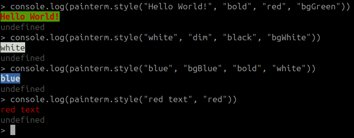

# painterm
Colours for node.js console outputs

Painterm currently supports the following colours

Foreground
- black
- red
- green
- yellow
- blue
- magenta
- cyan
- white
- default

Background
- bgBlack
- bgRed
- bgGreen
- bgYellow
- bgBlue
- bgMagenta
- bgCyan
- bgWhite
- bgDefault

Paintterm also supports changing text to bold or dim
